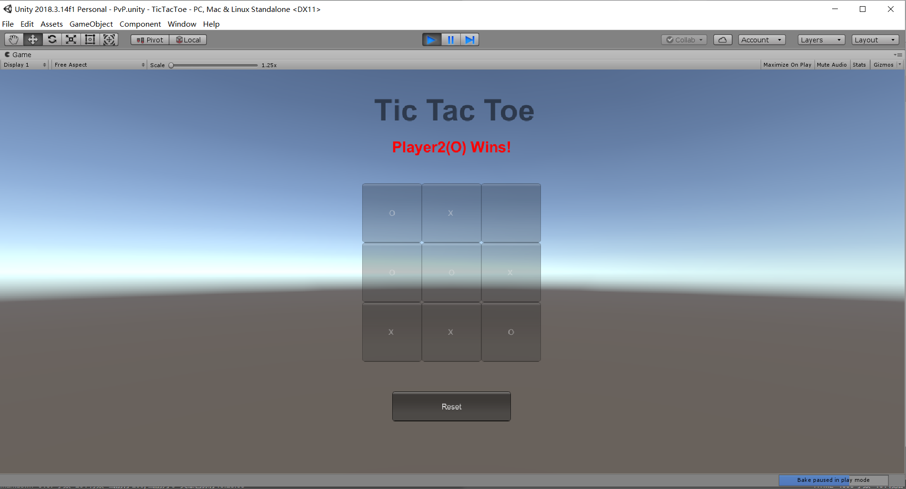

### Homework 1

> 数据科学与计算机学院 
>
> 17343012 陈泰霖 

#### 用IMGUI实现简单井字棋

我实现的是双人模式下的井字棋，第一位玩家用X表示，第二位玩家用O表示。

首先是定义一些变量：

```c#
bool playing = true;  //游戏是否在进行
int turn = 1;  //当前是谁的回合
int[,] symbol = new int [3,3];  //棋盘，0：未放置 1：X 2：O
```

初始时调用`Reset（）`函数清空棋盘

```c#
void Start () {
    Reset();
}
void Reset() {
    playing = true;
    turn = 1;
    for (int i = 0; i < 3; ++i) {
        for (int j = 0; j < 3; ++j) {
            symbol[i, j] = 0;
        }
    }
    GUI.enabled = true;
}
```

设置字体

```c#
GUIStyle tStyle = new GUIStyle {
    fontSize = 50,
    fontStyle = FontStyle.Bold
};
GUIStyle mStyle = new GUIStyle {
    fontSize = 25,
    fontStyle = FontStyle.Bold
};
mStyle.normal.textColor = Color.red;
```

通过`Check（）`函数判断游戏结果并输出。

```c#
//winner parameters
int winner = Check();
string msg = "";
//Check if someone wins or draw
if (winner>=1) {
    msg = (winner == 1 ? "Player1(X) Wins!" : "Player2(O) Wins!");
    GUI.Label(new Rect(width + 50, height - 75, 100, 100), msg, mStyle);
    playing = false;
    GUI.enabled = false;
}
if (winner==-1){
    msg = "Draw!";
    GUI.Label(new Rect(width + 100, height - 75, 50, 100), msg, mStyle);
    playing = false;
    GUI.enabled = false;
}
```

`Check（）`函数的实现，判断每行每列以及两条对角线。当棋盘上所有点都被覆盖且没有一方胜利时平局。

```c#
int Check() {
    //Row check
    for (int i = 0; i < 3; ++i) {
        if (symbol[i, 0] > 0 &&
            symbol[i, 0] == symbol[i, 1] &&
            symbol[i, 1] == symbol[i, 2]) {
            return symbol[i, 0];
        }
    }
    //Column check
    for (int j = 0; j < 3; ++j) {
        if (symbol[0, j] > 0 &&
            symbol[0, j] == symbol[1, j] &&
            symbol[1, j] == symbol[2, j]) {
            return symbol[0, j];
        }
    }
    //Cross line check
    if (symbol[1, 1] > 0) {
        if (symbol[1, 1] == symbol[0, 0] && symbol[1, 1] == symbol[2, 2] ||
            symbol[1, 1] == symbol[0, 2] && symbol[1, 1] == symbol[2, 0]) {
            return symbol[1, 1];
        }
    }
    int draw=-1;
    for (int i = 0; i < 3; i++) for (int j = 0; j < 3; j++) if (symbol[i,j]==0) draw=0;
    return draw;
}
```

设置标题以及棋盘UI

```c#
GUI.Label(new Rect(width + 20, height - 150, 100, 100), "Tic Tac Toe", tStyle);
for (int i = 0; i < 3; ++i) {
    for (int j = 0; j < 3; ++j) {
        if (symbol[i, j] == 1) {
            GUI.Button(new Rect(width + i * bWidth, height + j * bHeight, bWidth, bHeight), "X");
        } else if (symbol[i, j] == 2) {
            GUI.Button(new Rect(width + i * bWidth, height + j * bHeight, bWidth, bHeight), "O");
        } else {
            if (GUI.Button(new Rect(width + i * bWidth, height + j * bHeight, bWidth, bHeight), "")) {
                if (playing) {
                    symbol[i, j] = turn;
                    turn = 3 - turn;
                }
            }
        }
    }
}
```

设置reset键使游戏重新开始

```C#
if (GUI.Button(new Rect(width + bWidth / 2, height + 3.5f * bHeight, bWidth * 2, bHeight / 2), "Reset")) {
    Reset();
    return;
}
```

游戏效果如下图所示：

