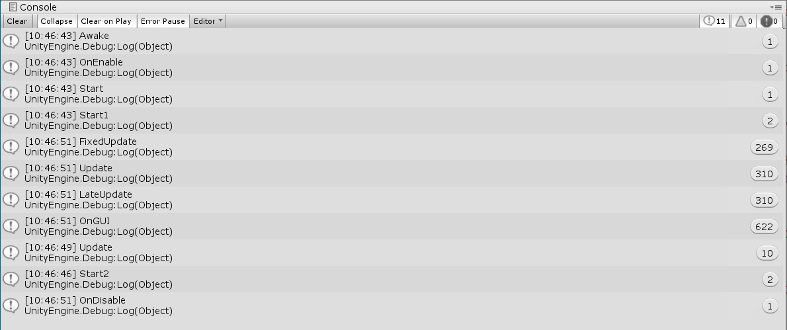

### Homework 1

> 数据科学与计算机学院 
>
> 17343012 陈泰霖 

#### 1.简答题

- ##### 解释游戏对象（GameObjects） 和资源（Assets）的区别与联系。

  ​		游戏对象是能够容纳组件的一种容器。根据要创建的对象类型，可以添加不同的组件组合到游戏对象中。
  ​		资源可以添加到游戏对象上，例如材质和动画运用到游戏对象上，有些资源作为模板，可实例化成游戏中具体的对象。

- ##### 下载几个游戏案例，分别总结资源、对象组织的结构（指资源的目录组织结构与游戏对象树的层次结构）

  ​		每个Unity的项目包含一个资源文件夹。此文件夹的内容呈现在项目视图。这里存放着游戏的所有资源，在资源文件夹中，通常有对象、材质、场景、声音、预设、贴图、脚本、动作，在这些文件夹下可以继续进行划分。
  ​		游戏对象树层次视图包含了每一个当前场景的所有游戏对象。其中一些是资源文件的实例，如3D模型和其他预制物体的实例。可以在层次结构视图中选择对象或者生成对象。当在场景中增加或者删除对象，层次结构视图中相应的对象则会出现或消失。想让一个游戏对象成为另一个的子对象，只需在层次视图中把它拖到另一个上即可。子对象使用的是以父对象为参照的相对坐标。

- ##### 编写一个代码，使用 debug 语句来验证 [MonoBehaviour](https://docs.unity3d.com/ScriptReference/MonoBehaviour.html) 基本行为或事件触发的条件

  ```c#
  public class TestMonoBehavior : MonoBehaviour{
      void Awake() {
          Debug.Log ("Awake");
      }
      void Start () {
          Debug.Log ("Start");
      }
      void Update () {
          Debug.Log ("Update");
      }
      void FixedUpdate() {
          Debug.Log ("FixedUpdate");
      }
      void LateUpdate() {
          Debug.Log ("LateUpdate");
      }
      void OnGUI() {
          Debug.Log ("OnGUI");
      }
      void OnDisable() {
          Debug.Log ("OnDisable");
      }
      void OnEnable() {
          Debug.Log ("OnEnable");
      }
  }
  ```

  

- ##### 查找脚本手册，了解 GameObject，Transform，Component 对象

  - ##### 分别翻译官方对三个对象的描述（Description）

    ​		GameObject是代表人物、道具和风景的基本对象在Unity中。它们本身并没有实现多少功能，但是它们充当Component的容器，这些Component实现了真正的功能。
    ​		Transform决定场景中每个对象的位置、旋转和缩放比例。每个GameObject都有一个Transform。
    ​		一个GameObject包含一个Component,可以通过 Inspector 来查看游戏对象的组件。

  - ##### 描述下图中 table 对象（实体）的属性、table 的 Transform 的属性、 table 的部件

    - ##### 本题目要求是把可视化图形编程界面与 Unity API 对应起来，当你在 Inspector 面板上每一个内容，应该知道对应 API。
    - ##### 例如：table 的对象是 GameObject，第一个选择框是 activeSelf 属性。

    table 的对象是 GameObject，第一个选择框是 activeSelf,table是name属性,旁边的Static的选择框是isStatic属性，Tag对应tag属性，Layer对应layer属性。
    Transform属性有position属性对应图中的Position，rotation属性对应Rotation,要修改Scale使用localScale属性。
    table 的部件有Box Collider，Mesh Renderer以及Default-Material。

    

    

  - ##### 用 UML 图描述 三者的关系（请使用 UMLet 14.1.1 stand-alone版本出图）
  
    

- ##### 整理相关学习资料，编写简单代码验证以下技术的实现：

  - ##### 查找对象
  - ##### 添加子对象
  - ##### 遍历对象树
  - ##### 清除所有子对象

  ```c#
  //按名字查找
  var cubeF = GameObject.Find("Cube");
  if (cubeF) {
      Debug.Log ("find cube by name");
  }
  //添加子对象到init
  GameObject Sphere = GameObject.CreatePrimitive (PrimitiveType.Sphere);
  Sphere.transform.position = new Vector3 (3, 3, 3);
  Sphere.transform.parent = transform;
  //遍历对象树
  GameObject[] game = GameObject.FindObjectsOfType<GameObject>();
  foreach (GameObject it in game) {
      Debug.Log (it.name);
  }
  //删除所有子对象
  foreach (GameObject it in game) {
       GameObject.Destroy (it);
  }
  ```

- ##### 资源预设（Prefabs）与 对象克隆 (clone)

  - ##### 预设（Prefabs）有什么好处？

    使对象和资源能够重复利用。

    相同的游戏对象可以用同一个预制来创建。

    对预设进行修改后，所有的游戏对象都会发生改变

  - ##### 预设与对象克隆 (clone or copy or Instantiate of Unity Object) 关系？

    克隆游戏对象需要场景中有被克隆对象，而创建预制只需事先创建预制即可，允许场景中一开始并不存在该游戏对象。

    克隆出来的游戏对象并不会随着被克隆体的变化而发生变化，但是使用预制创建出来的对象会随着预制的改变而发生改变

  - ##### 制作 table 预制，写一段代码将 table 预制资源实例化成游戏对象

    ```c#
    public Transform table;
    Resources.Load("table");
    GameObject anotherTable = (GameObject)Instantiate(table.gameObject);
    ```

