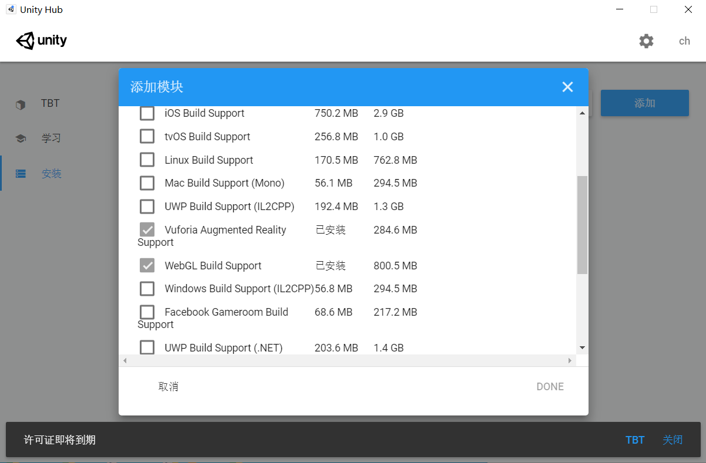
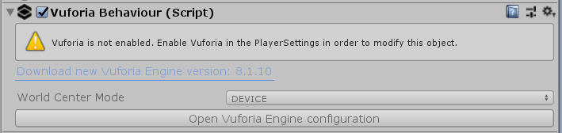
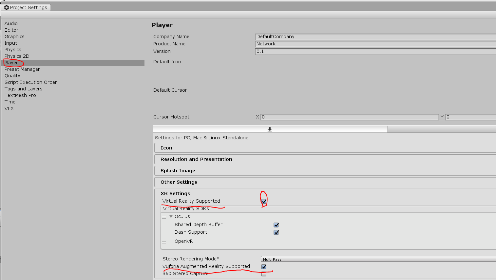
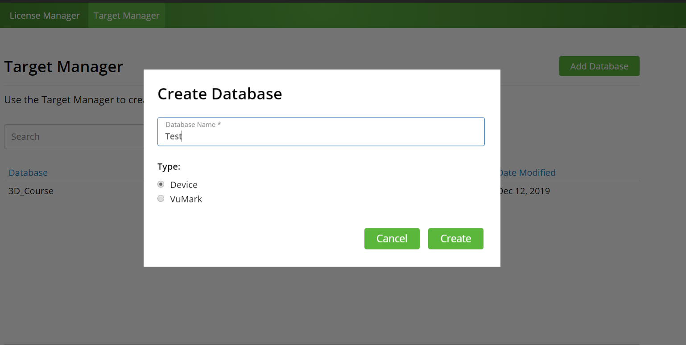
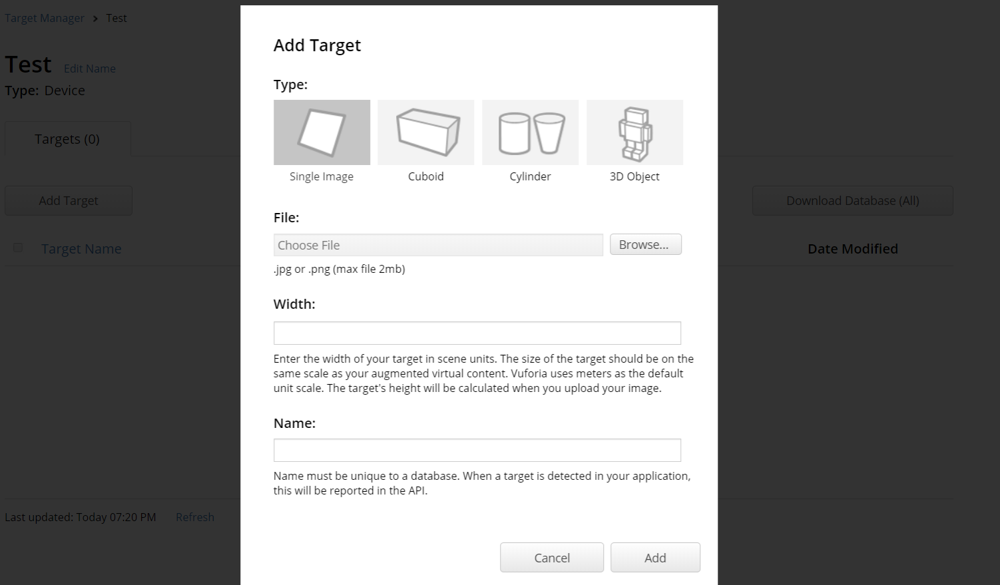
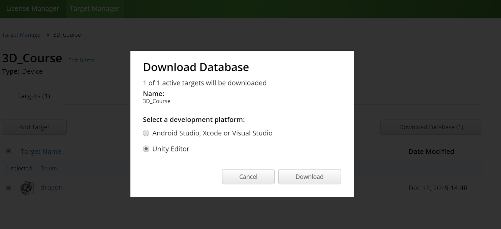
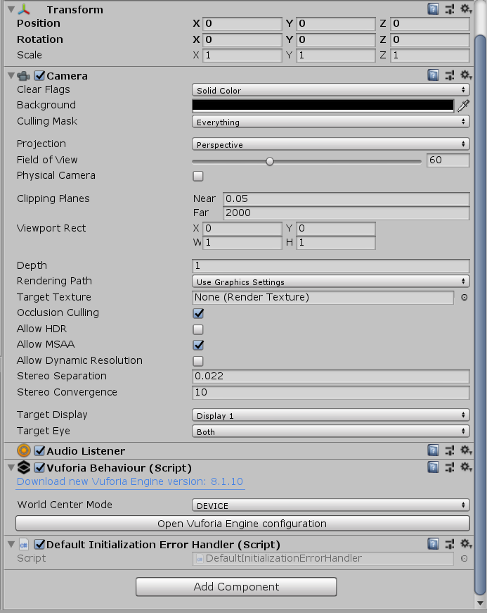
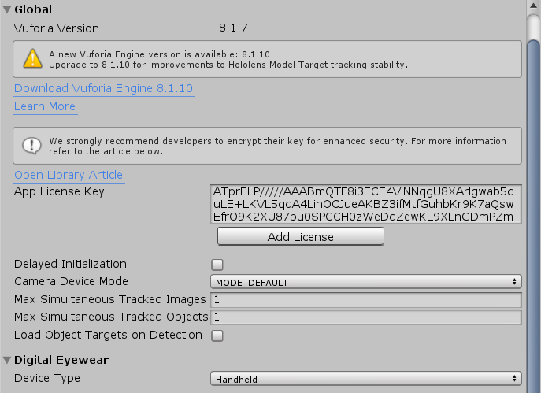
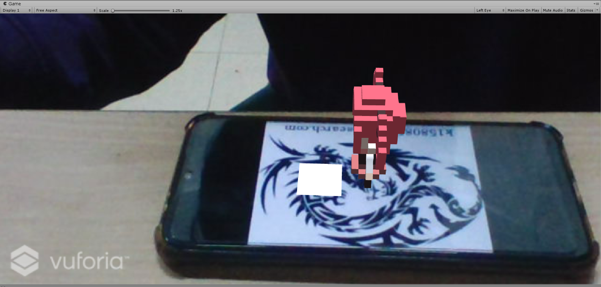

# AR/MR 技术

## 实现过程

1. 打开Unity Hub，点击添加模块，勾选`Vuforia Augmented Reality Support`

   

2. 这个时候在unity中`GameObject`->`Vuforia Engine`->`AR Camera`就可以启动AR摄像头了。

   但是会发现无法点击`Open Vuforia Engine configuration`。

   

   此时应该`Edit`->`Project settings`->`Player`勾选`Virtural Reality Supported`和`Vufoira Augmented Reallity Supported`

   

3. 在Vuforia官网进行注册登录，创建证书用于获取License Key，创建目标数据库，用于对所有的Target及其特征数据进行管理和保存

   

4. 把image导入数据库，并下载下来，在unity中打开并导入

   

   

5. 在unity的`AR Camera`中，点击`Open Vuforia Engine configuration`，在`App License Key`中把Target的License复制进去，数据库会自动导入。





6. 点击`GameObject`->`Vuforia Engine`->`image`就可以得到`ImageTarget`，选择一个3D物体成为其子对象就可以了。
7. 运行，让设备的摄像头面对一张有导入图案的纸或是手机就可以看到AR效果



8. 增加虚拟按键和设置动画控制器，使得可以实现虚拟按键效果，虚拟按键应该有一个`Plane`的子对象否则按键无法实现
9. 在`ImageTarget`中添加代码

```c#
using UnityEngine;
using Vuforia;
public class VirtualButtonEventHandler :  MonoBehaviour, Vuforia.IVirtualButtonEventHandler
{
    public GameObject vb;
    public Animator ani;
    void Start()
    {
        VirtualButtonBehaviour vbb = vb.GetComponent<VirtualButtonBehaviour>();
        // 为每个虚拟按钮注册按钮响应事件。
        if (vbb)
        {
            vbb.RegisterEventHandler(this);
        }
    }

    public void OnButtonPressed(VirtualButtonBehaviour vb)
    {
        Debug.Log("OnButtonPressed: " + vb.VirtualButtonName);
        ani.SetTrigger("Idle_Run");
    }
    public void OnButtonReleased(VirtualButtonBehaviour vb)
    {
        Debug.Log("OnButtonReleased: " + vb.VirtualButtonName);
        ani.SetTrigger("Run_Idel");
    }
}	
```

## 运行效果


