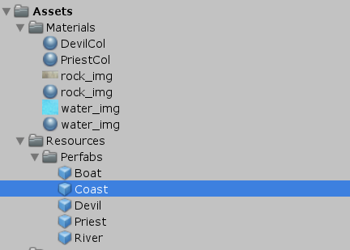
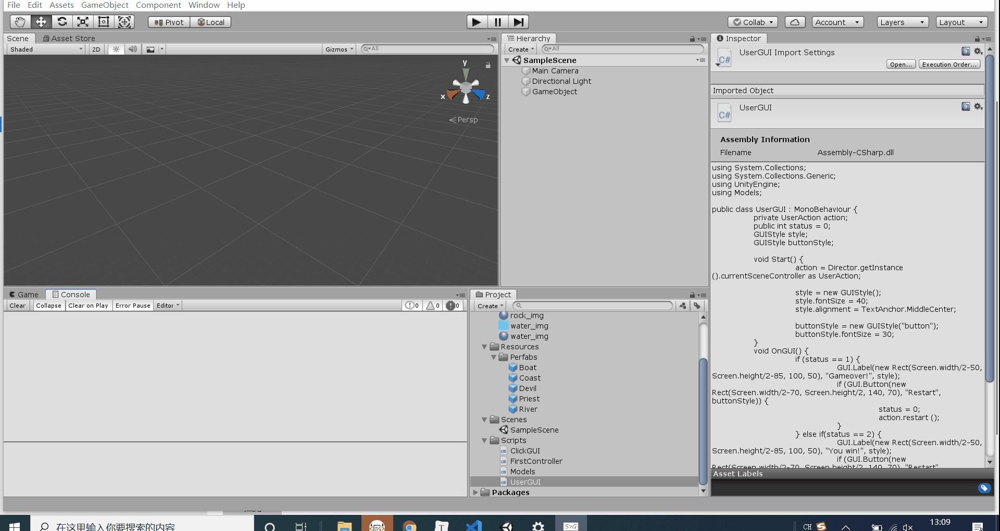

# Homework 2

> 数据科学与计算机学院 
>
> 17343012 陈泰霖 

### 编程实践——Priests and Devils

>*Priests and Devils is a puzzle game in which you will help the Priests and Devils to cross the river within the time limit. There are 3 priests and 3 devils at one side of the river. They all want to get to the other side of this river, but there is only one boat and this boat can only carry two persons each time. And there must be one person steering the boat from one side to the other side. In the flash game, you can click on them to move them and click the go button to move the boat to the other direction. If the priests are out numbered by the devils on either side of the river, they get killed and the game is over. You can try it in many > ways. Keep all priests alive! Good luck!*

- 游戏中提及的事物有：河岸Coast（包括起始河岸和目的河岸），河River，3个牧师Priests，3个魔鬼Devils，船。

- 玩家动作表：

  | 事物      |                      |
  | --------- | -------------------- |
  | 牧师/魔鬼 | 从河岸上船           |
  | 牧师/魔鬼 | 从船上河岸           |
  | 船        | 从河岸行驶到另一河岸 |


- 预制游戏中的对象：

  

- 在 GenGameObjects 中创建 长方形、正方形、球 及其色彩代表游戏中的对象:

  我用金色的方块代表牧师，红色的球代表恶魔，蓝色的细长长方体代表河流，带有纹理的方块代表河岸，方块代表船，游戏效果图如下：


- 使用MVC结构实现程序

首先是Model部分，

首先建立一个Director类，它使用单例模式，控制场景控制器。

```c#
public class Director : System.Object {
    private static Director _instance; 
    public static Director getInstance() { //使用单例模式
        if (_instance == null) _instance = new Director ();
        return _instance;
    }
    public SceneController currentSceneController { get; set; } //控制场景控制器
}
```

建立场景控制器接口

并在Controller中实现，它需要加载各种资源以及人物（牧师/魔鬼）

```c#
public interface SceneController {
    void loadResources();
    void loadCharacter();
}
```

建立用户操作接口

并在Controller中实现，它需要实现点击船让船运动，点击人物让人物运动，游戏结束时点击`restart`按钮使游戏重新开始

```c#
public interface UserAction {
    void ClickBoat();
    void ClickCha(ChaCon characterCtrl);
    void restart();
}
```

建立运动类

运动类是船或者人物的组件，实现事物的运动。因为人物运动时跨度比较大，比如说从船到河岸，需要先到船边，然后到河岸的对应位置，所以需要设置运动类的状态为3种，分别为没有运动，从开始运动到中途，从中途运动到终点。我在`update`函数中进行`transform`位置的移动。并设置了`setDest`函数，当事物调用了这个函数时，`update`函数会自动地使事物进行移动。

```c#
void Update() {
    if (status == 1) {
        transform.position = Vector3.MoveTowards (transform.position, mid, speed * Time.deltaTime);
        if (transform.position == mid) status = 2;
    } 
    if (status == 2) {
        transform.position = Vector3.MoveTowards (transform.position, dest, speed * Time.deltaTime);
        if (transform.position == dest) status = 0;
    }
}

public void setDest(Vector3 _dest) {
    dest = _dest;
    mid = _dest;
    if (_dest.y == transform.position.y) status = 2; //boat
    else {
        if (_dest.y < transform.position.y) mid.y = transform.position.y;	// from coast to boat
        else mid.x = transform.position.x;	// from boat to coast
        status = 1;
    }
}
```

建立人物（牧师/魔鬼）控制器

需要有人物的`GameObject`，人物的类型（用0表示牧师，1表示魔鬼），运动类的组件，可供点击的`ClickGUI`，是否在船上的布尔变量，当前在哪个河岸的河岸控制器（如果不在河岸就为null）。

构造函数实例化`GameObject`，设置了位置向量，增加了运动类组件和可供点击的`ClickGUI`.

```c#
public ChaCon(string name) {
    if (name == "priest") {
        character = Object.Instantiate (Resources.Load ("Perfabs/Priest", typeof(GameObject)), Vector3.zero, Quaternion.identity, null) as GameObject;
        characterType = 0;
    } else {
        character = Object.Instantiate (Resources.Load ("Perfabs/Devil", typeof(GameObject)), Vector3.zero, Quaternion.identity, null) as GameObject;
        characterType = 1;
    }
    move = character.AddComponent (typeof(Move)) as Move;
    clickGUI = character.AddComponent (typeof(ClickGUI)) as ClickGUI;
    clickGUI.setController (this);
}
```

上船或是上岸时对所属河岸控制器和是否在船上的布尔变量进行修改。

```c#
public void getOnBoat(BoatCon boat) {
    CoastCon = null;
    character.transform.parent = boat.getGameobj().transform;
    isonboat = true;
}

public void getOnCoast(CoastCon coast) {
    CoastCon = coast;
    character.transform.parent = null;
    isonboat = false;
}
```

建立河岸控制器

需要有河岸的`GameObject`，状态量表示是起始河岸或是终点河岸，位置数组以及人物控制器数组表示在该河岸上的位置和人物。

构造函数设置了位置数组，对`GameObject`进行实例化。

```c#
public CoastCon(string _status) {
    positions = new Vector3[] {new Vector3(6.5F,2.25F,0), new Vector3(7.5F,2.25F,0), new Vector3(8.5F,2.25F,0), 
                               new Vector3(9.5F,2.25F,0), new Vector3(10.5F,2.25F,0), new Vector3(11.5F,2.25F,0)};

    passenger = new ChaCon[6];

    if (_status == "from") {
        coast = Object.Instantiate (Resources.Load ("Perfabs/Coast", typeof(GameObject)), from_pos, Quaternion.identity, null) as GameObject;
        coast.name = "from";
        status = 1;
    } else {
        coast = Object.Instantiate (Resources.Load ("Perfabs/Coast", typeof(GameObject)), to_pos, Quaternion.identity, null) as GameObject;
        coast.name = "to";
        status = -1;
    }
}
```

当人物需要上岸时，需要找到空闲位置从而得到人物运动的目的地，并修改人物数组。当人物下岸时遍历人物数组进行修改。

```c#
public void getOnCoast(ChaCon cha) {
    int index = getEmptyIndex();
    passenger[index] = cha;
}

public ChaCon getOffCoast(string name) {	// 0->priest, 1->devil
    for (int i = 0; i < passenger.Length; i++) {
        if (passenger[i] != null && passenger[i].getName() == name) {
            ChaCon cha = passenger [i];
            passenger [i] = null;
            return cha;
        }
    }
    return null;
}
```

建立船控制器

需要船的`GameObejct`，运动类，船运动方向的状态（1为从起始河岸到终点河岸，-1为从终点河岸到起始河岸），人物数组，位置数组。

在构造函数中进行`GameObject`的实例化，增加运动类组件，`ClickGUI`组件。

```c#
public BoatCon() {
    status = 1;
    from_positions = new Vector3[] { new Vector3 (4.5F, 1.5F, 0), new Vector3 (5.5F, 1.5F, 0) };
    to_positions = new Vector3[] { new Vector3 (-5.5F, 1.5F, 0), new Vector3 (-4.5F, 1.5F, 0) };

    boat = Object.Instantiate (Resources.Load ("Perfabs/Boat", typeof(GameObject)), fromPosition, Quaternion.identity, null) as GameObject;
    boat.name = "boat";

    move = boat.AddComponent (typeof(Move)) as Move;
    boat.AddComponent (typeof(ClickGUI));
}
```

运动时设置运动类的终点，并将运动方向状态取反。

```c#
public void Move() {
    if (status == -1) move.setDest(fromPosition);
    else move.setDest(toPosition);
    status=-status;
}
```

与河岸控制器类似，在上船和下船时需要寻找空闲位置，修改人物数组。


接下来是Controller部分

它需要实现在Model中的`SceneController`和`UserAction`接口。

在`Awake`函数中，获得`Director`类的实例，加载资源和人物，实现一开始场景的加载。

```c#
void Awake() {
    Director director = Director.getInstance ();
    director.currentSceneController = this;
    userGUI = gameObject.AddComponent <UserGUI>() as UserGUI;
    characters = new ChaCon[6];
    loadResources();
    loadCharacter();
}
```

实现`SceneController`接口，实现加载资源和人物函数。

加载资源和人物就是调用Model部分中的对应类的构造函数进行实例化。同时，需要进行一些初始化操作：人物上到起始河岸，记录起始河岸承载的人物。

```c#
public void loadResources() {
    Vector3 river_pos = new Vector3(0,0.5F,0);
    GameObject river = Instantiate (Resources.Load ("Perfabs/River", typeof(GameObject)), river_pos, Quaternion.identity, null) as GameObject;
    river.name = "river";
    fromCoast = new CoastCon ("from");
    toCoast = new CoastCon ("to");
    boat = new BoatCon ();
}

public void loadCharacter() {
    for (int i = 0; i < 3; i++) {
        ChaCon cha = new ChaCon ("priest");
        cha.setName("priest" + i);
        cha.setPosition (fromCoast.getEmptyPosition ());
        cha.getOnCoast (fromCoast);
        fromCoast.getOnCoast (cha);
        characters [i] = cha;
    }
    for (int i = 0; i < 3; i++) {
        ChaCon cha = new ChaCon ("devil");
        cha.setName("devil" + i);
        cha.setPosition (fromCoast.getEmptyPosition ());
        cha.getOnCoast (fromCoast);
        fromCoast.getOnCoast (cha);
        characters [i+3] = cha;
    }
}
```

实现`UserAction`接口，需要实现对船和人物的点击函数。

对船的点击函数，首先需要判断船是否为空，如果为空则不能运动，船运动后根据规则判定游戏结果。

```c#
public void ClickBoat() {
    if (boat.isEmpty ()) return;
    boat.Move ();
    userGUI.status = check();
}
```

对人物的点击函数需要求出目的地的空位，调用人物类中的`moveToPosition`函数进行运动，并同时对人物所属的河岸控制器进行修改，调用船或河岸的函数实现上/下的逻辑。最后根据规则判定游戏结果。

```c#
public void ClickCha(ChaCon cha) {
    if (cha.isOnBoat ()) {
        CoastCon nowCoast;
        if (boat.getStatus () == -1) nowCoast = toCoast; // to->-1; from->1	
        else nowCoast = fromCoast;
        boat.getOffBoat (cha.getName());
        cha.moveToPosition (nowCoast.getEmptyPosition ());
        cha.getOnCoast (nowCoast);
        nowCoast.getOnCoast (cha);
    } 
    else {									// character on coast
        CoastCon nowCoast = cha.getCoastCon ();
        if (boat.getEmptyIndex () == -1) return; // boat is full
        if (nowCoast.getStatus () != boat.getStatus ())	return; // boat is not on the side of character
        nowCoast.getOffCoast(cha.getName());
        cha.moveToPosition (boat.getEmptyPosition());
        cha.getOnBoat (boat);
        boat.getOnBoat (cha);
    }
    userGUI.status = check();
}
```

`check`函数实现了对游戏结果的判定：如果终点河岸人数为6则胜利，如果有一边河岸和靠岸的船（如果存在）中魔鬼人数大于牧师人数且牧师人数不为0则失败，否则游戏继续进行。

```c#
int check() {	// 0->not finish, 1->lose, 2->win
    int fromP = 0, fromD = 0, toP = 0, toD = 0;
    int[] fromCount = fromCoast.getCharacterNum();
    fromP += fromCount[0];
    fromD += fromCount[1];

    int[] toCount = toCoast.getCharacterNum ();
    toP += toCount[0];
    toD += toCount[1];

    if (toP + toD == 6) return 2; //win
    int[] boatCount = boat.getCharacterNum ();
    if (boat.getStatus () == -1) {
        toP += boatCount[0]; toD += boatCount[1];	// boat at toCoast
    }
    else {
        fromP += boatCount[0]; fromD += boatCount[1];	// boat at fromCoast	
    }
    if (fromP < fromD && fromP > 0) return 1; //lose		
    if (toP < toD && toP > 0) return 1; //lose
    return 0;			// not finish
}
```

最后是View部分，在`UserGUI`类中绘制胜利或失败时的label以及button。

```c#
void OnGUI() {
    if (status == 1) {
        GUI.Label(new Rect(Screen.width/2-50, Screen.height/2-85, 100, 50), "Gameover!", style);
        if (GUI.Button(new Rect(Screen.width/2-70, Screen.height/2, 140, 70), "Restart", buttonStyle)) {
            status = 0;
            action.restart ();
        }
    } else if(status == 2) {
        GUI.Label(new Rect(Screen.width/2-50, Screen.height/2-85, 100, 50), "You win!", style);
        if (GUI.Button(new Rect(Screen.width/2-70, Screen.height/2, 140, 70), "Restart", buttonStyle)) {
            status = 0;
            action.restart ();
        }
    }
}
```



