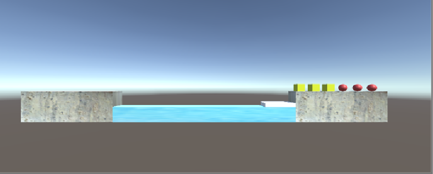

# Homework 3

### 编程实践——Priests and Devils 动作分离版

>*Priests and Devils is a puzzle game in which you will help the Priests and Devils to cross the river within the time limit. There are 3 priests and 3 devils at one side of the river. They all want to get to the other side of this river, but there is only one boat and this boat can only carry two persons each time. And there must be one person steering the boat from one side to the other side. In the flash game, you can click on them to move them and click the go button to move the boat to the other direction. If the priests are out numbered by the devils on either side of the river, they get killed and the game is over. You can try it in many > ways. Keep all priests alive! Good luck!*

- 游戏中提及的事物有：河岸Coast（包括起始河岸和目的河岸），河River，3个牧师Priests，3个魔鬼Devils，船。

- 玩家动作表：

  | 事物      |                      |
  | --------- | -------------------- |
  | 牧师/魔鬼 | 从河岸上船           |
  | 牧师/魔鬼 | 从船上河岸           |
  | 船        | 从河岸行驶到另一河岸 |


- 预制游戏中的对象：

  

- 在 GameObjects 中创建 长方形、正方形、球 及其色彩代表游戏中的对象:

  我用金色的方块代表牧师，红色的球代表恶魔，蓝色的细长长方体代表河流，带有纹理的方块代表河岸，方块代表船，游戏效果图如下：




本次实践依然是采用MVC结构实现，与上一次无动作分离版的区别在于，之前对于动作的管理是实现了一个动作类，当鼠标点击船或是人物时，相当于是控制器让船或人物的实例调用动作类来实现运动。这次实践中将船或人物与动作分离开来，单独实现了一个动作管理器，鼠标点击船或是人物时，相当于是控制器直接将动作请求传给动作管理器，动作管理器来实现船或人物的运动。

##### 接下来介绍动作管理器的实现：

- `SSActionManager`（动作管理基类）
  管理`SequenceAction`和`SSAction`，可以给它们传递游戏对象，让游戏对象做动作或是一连串的动作，控制动作的切换。`SSActionManager`继承了`ISSActionCallback`接口，通过这个接口，当动作做完或是连续的动作做完时候会告诉`SSActionManager`，然后`SSActionManager`去决定如何执行下一个动作。

  ```c#
  public class SSActionManager : MonoBehaviour, ISSActionCallback {                     //action管理器
  
      private Dictionary<int, SSAction> actions = new Dictionary<int, SSAction>();    //将执行的动作的字典集合,int为key，SSAction为value
      private List<SSAction> waitingAdd = new List<SSAction>();                       //等待去执行的动作列表
      private List<int> waitingDelete = new List<int>();                              //等待删除的动作的key                
  
      protected void Update(){
          foreach (SSAction ac in waitingAdd){
              actions[ac.GetInstanceID()] = ac;                                      //获取动作实例的ID作为key
          }
          waitingAdd.Clear();
  
          foreach (KeyValuePair<int, SSAction> kv in actions){
              SSAction ac = kv.Value;
              if (ac.destroy) waitingDelete.Add(ac.GetInstanceID());
              else if (ac.enable) ac.Update();
          }
  
          foreach (int key in waitingDelete){
              SSAction ac = actions[key];
              actions.Remove(key);
              Object.Destroy(ac);
          }
          waitingDelete.Clear();
      }
  
      public void RunAction(GameObject gameobject, SSAction action, ISSActionCallback manager){
          action.gameobject = gameobject;
          action.transform = gameobject.transform;
          action.callback = manager;
          waitingAdd.Add(action);
          action.Start();
      }
  
      public void SSActionEvent(SSAction source, SSActionEventType events = SSActionEventType.Competeted,
          int intParam = 0, string strParam = null, Object objectParam = null){
          //牧师与魔鬼的游戏对象移动完成后就没有下一个要做的动作了，所以回调函数为空
      }
  }
  ```

- `SequenceAction`（组合动作实现）
  `SequenceAction`继承了`ISSActionCallback`，因为组合动作是每一个动作的顺序完成，它管理这一连串动作中的每一个小的动作，所以当小的动作完成的时候，也要发消息告诉它，然后它得到消息后去处理下一个动作。`SequenceAction`也继承了`SSAction`，因为成个组合动作也需要游戏对象，也需要标识是否摧毁，也会有一个组合动作的管理者的接口，组成动作也是动作的子类，只不过是让具体的动作组合起来做罢了。

  ```c#
  public class SequenceAction : SSAction, ISSActionCallback{
      public List<SSAction> sequence;    //动作的列表
      public int repeat = -1;            //-1就是无限循环做组合中的动作
      public int start = 0;              //当前做的动作的索引
  
      public static SequenceAction GetSSAcition(int repeat, int start, List<SSAction> sequence){
          SequenceAction action = ScriptableObject.CreateInstance<SequenceAction>();//让unity自己创建一个SequenceAction实例
          action.repeat = repeat;
          action.sequence = sequence;
          action.start = start;
          return action;
      }
  
      public override void Update(){
          if (sequence.Count == 0) return;
          if (start < sequence.Count){
              sequence[start].Update();     //一个组合中的一个动作执行完后会调用接口,所以这里看似没有start++实则是在回调接口函数中实现
          }
      }
  
      public void SSActionEvent(SSAction source, SSActionEventType events = SSActionEventType.Competeted,
          int intParam = 0, string strParam = null, Object objectParam = null){
          source.destroy = false;          //先保留这个动作，如果是无限循环动作组合之后还需要使用
          this.start++;
          if (this.start >= sequence.Count){
              this.start = 0;
              if (repeat > 0) repeat--;
              if (repeat == 0){
                  this.destroy = true;               //整个组合动作就删除
                  this.callback.SSActionEvent(this); //告诉组合动作的管理对象组合做完了
              }
          }
      }
  
      public override void Start(){
          foreach (SSAction action in sequence){
              action.gameobject = this.gameobject;
              action.transform = this.transform;
              action.callback = this;                //组合动作的每个小的动作的回调是这个组合动作
              action.Start();
          }
      }
  
      void OnDestroy(){
          //如果组合动作做完第一个动作突然不要它继续做了，那么后面的具体的动作需要被释放
      }
  }
  ```

- `SSAction` （动作基类）
  `SSAction`是所有动作的基类。`SSAction`继承了`ScriptableObject`代表`SSAction`不需要绑定`GameObject`对象，且受Unity引擎场景管理。

  ```C#
  public class SSAction : ScriptableObject {           //动作
  
      public bool enable = true;                      //是否正在进行此动作
      public bool destroy = false;                    //是否需要被销毁
  
      public GameObject gameobject;                   //动作对象
      public Transform transform;                     //动作对象的transform
      public ISSActionCallback callback;              //回调函数
  
      protected SSAction() { }                        //保证SSAction不会被new
  
      public virtual void Start() {                   //子类可以使用这两个函数
          throw new System.NotImplementedException();
      }
  
      public virtual void Update(){
          throw new System.NotImplementedException();
      }
  }
  ```

- `SSActionManager`牧师与魔鬼的动作实现

  实现了`moveBoat`和`moveCha`两个函数来实现对船和对人物的运动的实现，传递运动的事物，目的地，以及速度就可以通过上面实现的运动管理器实现运动。

  ```c#
  public class MySceneActionManager : SSActionManager{  //本游戏管理器
  
      private SSMoveToAction moveBoatToEndOrStart;     //移动船到结束岸，移动船到开始岸
      private SequenceAction moveChaToCoastorBoat;     //移动角色到河岸，移动角色到船上
  
      public FirstController sceneController;
  
      protected void Start(){
          sceneController = (FirstController)Director.getInstance().currentSceneController;
          sceneController.actionManager = this;
      }
      public void moveBoat(GameObject boat, Vector3 target, float speed){
          moveBoatToEndOrStart = SSMoveToAction.GetSSAction(target, speed);
          this.RunAction(boat, moveBoatToEndOrStart, this);
      }
  
      public void moveCha(GameObject Cha, Vector3 middle_pos, Vector3 end_pos, float speed){
          SSAction action1 = SSMoveToAction.GetSSAction(middle_pos, speed);
          SSAction action2 = SSMoveToAction.GetSSAction(end_pos, speed);
          moveChaToCoastorBoat = SequenceAction.GetSSAcition(1, 0, new List<SSAction> { action1, action2 });
          this.RunAction(Cha, moveChaTCoastdorBoat, this);
      }
  }
  ```


通过动作管理器就实现了事物与运动的分离，可以方便地实现一系列动作的实现，减少了耦合，提高了代码的复用性，比如在今后要设计新的游戏动作时，动作管理器的代码大部分都是可以复用的，需要做的只是把`SSActionManager`改成相对应的逻辑即可。


除了实现动作管理器之外，我还单独实现了裁判类，通过裁判类来实现对当前局面胜负关系的判断，上个版本中这一功能是内嵌在`FirstController`中，实现了一个函数来实现的。

```c#
public class Judger : System.Object {
    private static Judger _instance; 
    public static Judger getInstance() { //使用单例模式
        if (_instance == null) _instance = new Judger ();
        return _instance;
    }
    public int check(CoastCon fromCoast,CoastCon toCoast,BoatCon boat) {	// 0->not finish, 1->lose, 2->win
        int fromP = 0, fromD = 0, toP = 0, toD = 0;
        int[] fromCount = fromCoast.getCharacterNum();
        fromP += fromCount[0];
        fromD += fromCount[1];

        int[] toCount = toCoast.getCharacterNum ();
        toP += toCount[0];
        toD += toCount[1];

        if (toP + toD == 6) return 2; //win
        int[] boatCount = boat.getCharacterNum ();
        if (boat.getStatus () == -1) {
            toP += boatCount[0]; toD += boatCount[1];	// boat at toCoast
        }
        else {
            fromP += boatCount[0]; fromD += boatCount[1];	// boat at fromCoast	
        }
        if (fromP < fromD && fromP > 0) return 1; //lose		
        if (toP < toD && toP > 0) return 1; //lose
        return 0;			// not finish
    }
}
```

而`FirstController`只需要调用`Judger.getInstance().check(fromCoast,toCoast,boat)`，将起始河岸，终止河岸，船的实例作为参数传入就可以实现对当前局面胜负关系的判断了。


本实践的MVC结构实现与上一次实践的实现类似，可以通过这篇[博客](https://blog.csdn.net/ctlchild/article/details/100980181)获得，此处不再赘述。


游戏效果演示：


