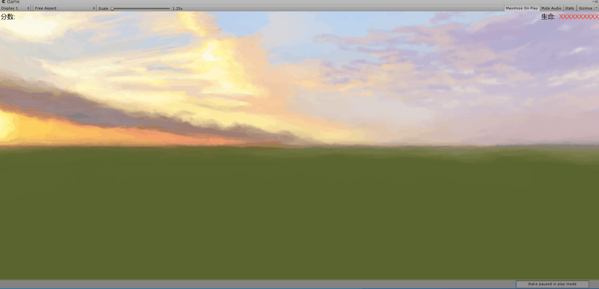

# Homework 5

### 编程实践——打飞碟（Hit UFO）游戏运动与物理兼容版

这次编程实践是在上一次实践的基础上，增加了物理运动，做到了运动学和物理运动会的兼容。而原来的代码只实现了运动学部分。

首先需要实现物理运动部分的`Action`类和`ActionManager`类。

相比起运动学复杂的位置计算，这里只需要设定重力和给一个初速度就可以了。

```c#
public class PhyUFOFlyAction : SSAction{
    private Vector3 start_vector;                              //初速度向量
    public float power;
    private PhyUFOFlyAction() {}
    public static PhyUFOFlyAction GetSSAction(Vector3 direction, float angle, float power){
        //初始化物体将要运动的初速度向量
        PhyUFOFlyAction action = CreateInstance<PhyUFOFlyAction>();
        if (direction.x == -1) action.start_vector = Quaternion.Euler(new Vector3(0, 0, -angle)) * Vector3.left * power;
        else action.start_vector = Quaternion.Euler(new Vector3(0, 0, angle)) * Vector3.right * power;
        action.power = power;
        return action;
    }

    public override void Update() { 
        if (this.transform.position.y < -10){
            this.destroy = true;
            this.callback.SSActionEvent(this);
        }
    }
    public override void Start(){
        //使用重力以及给一个初速度
        gameobject.GetComponent<Rigidbody>().velocity = power / 13 * start_vector;
        gameobject.GetComponent<Rigidbody>().useGravity = true;
    }
}
```

`ActionManager`类与之前运动学实现的`ActionManager`基本一致。

```c#
public class PhyActionManager : SSActionManager{
    public PhyUFOFlyAction fly;
    protected void Start(){  
    }
    //飞碟飞行
    public void UFOFly(GameObject disk, float angle, float power){
        fly = PhyUFOFlyAction.GetSSAction(disk.GetComponent<DiskData>().direction, angle, power);
        this.RunAction(disk, fly, this);
    }

}
```

用Adapter模式写一个适配器，使其能选择运动学和物理运动来实现飞碟的飞行。

```c#
public class Adapter : MonoBehaviour,AdaActionmanager {
    public FlyActionManager fly_action_manager;
    public PhyActionManager phy_action_manager;
    public void UFOFly(GameObject disk,float angle,float power,bool op){
        if (op) phy_action_manager.UFOFly(disk,angle,power);
        else fly_action_manager.UFOFly(disk,angle,power);
    }
    void Start(){
        fly_action_manager=gameObject.AddComponent<FlyActionManager>() as FlyActionManager;
        phy_action_manager=gameObject.AddComponent<PhyActionManager>() as PhyActionManager;
    }
}

```

在上述代码中，当`op=true`时选择物理运动实现，`op=false`时选择运动学实现。

最后我们只要将`FirstController`中所有调用运动学的部分改成调用这个`Adapter`就可以了。


因为加上了刚体，飞碟会发生碰撞，飞碟飞行时容易发生变轨，对于飞碟的轨道预测有了更大难度，也就是说，这个游戏更难了。。


游戏效果：

