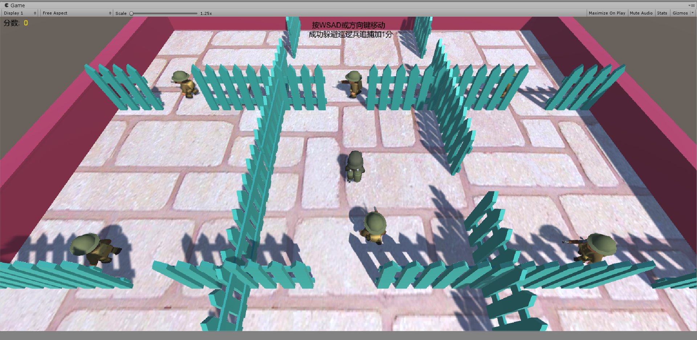

# Homework 6

### 编程实践——智能巡逻兵

##### 游戏设计要求：

- 创建一个地图和若干巡逻兵(使用动画)；
- 每个巡逻兵走一个3~5个边的凸多边型，位置数据是相对地址。即每次确定下一个目标位置，用自己当前位置为原点计算；
- 巡逻兵碰撞到障碍物，则会自动选下一个点为目标；
- 巡逻兵在设定范围内感知到玩家，会自动追击玩家；
- 失去玩家目标后，继续巡逻；
- 计分：玩家每次甩掉一个巡逻兵计一分，与巡逻兵碰撞游戏结束；

##### 实验过程：

游戏开始时初始化函数如下

```c#
void Start () {
        SSDirector director = SSDirector.GetInstance ();
        director.CurrentScenceController = this;
        patrol_factory = Singleton<PropFactory>.Instance;
        action_manager = gameObject.AddComponent<PatrolActionManager> () as PatrolActionManager;
        LoadResources ();
        main_camera.GetComponent<CameraFlow> ().follow = player;
        recorder = Singleton<ScoreRecorder>.Instance;
    }

    public void LoadResources () {
        Instantiate (Resources.Load<GameObject> ("Prefabs/Plane"));
        player = Instantiate (Resources.Load ("Prefabs/Player"), new Vector3 (0, 9, 0), Quaternion.identity) as GameObject;
        patrols = patrol_factory.GetPatrols ();
        //所有侦察兵移动
        for (int i = 0; i < patrols.Count; i++) {
            action_manager.GoPatrol (patrols[i]);
        }
    }
```

用工厂模式实现巡逻兵的生成，并使用了单例模式。棋盘分成了3*3一共9块区域，每个区域有一位巡逻兵。

```c#
public class PropFactory : MonoBehaviour {
    private GameObject patrol = null; //巡逻兵
    private List<GameObject> used = new List<GameObject> (); //正在被使用的巡逻兵
    private Vector3[] vec = new Vector3[9]; //保存每个巡逻兵的初始位置

    public FirstSceneController sceneControler; //场景控制器

    public List<GameObject> GetPatrols () {
        int[] pos_x = {-6, 4, 13 };
        int[] pos_z = {-4, 6, -13 };
        int index = 0;
        //生成不同的巡逻兵初始位置
        for (int i = 0; i < 3; i++) {
            for (int j = 0; j < 3; j++) {
                vec[index] = new Vector3 (pos_x[i], 0, pos_z[j]);
                index++;
            }
        }
        for (int i = 0; i < 9; i++) {
            patrol = Instantiate (Resources.Load<GameObject> ("Prefabs/Patrol"));
            patrol.transform.position = vec[i];
            patrol.GetComponent<PatrolData> ().sign = i + 1;
            patrol.GetComponent<PatrolData> ().start_position = vec[i];
            used.Add (patrol);
        }
        return used;
    }
    public void StopPatrol () {
        //切换所有侦查兵的动画
        for (int i = 0; i < used.Count; i++) {
            used[i].gameObject.GetComponent<Animator> ().SetBool ("run", false);
        }
    }
}
```

摄像机也是单例模式，它会锁定玩家视角，其中使用了`Vector3.Lerp()`函数用插值的方法对摄像机移动进行了平滑过渡

```c#
public class CameraFlow : MonoBehaviour {
    public GameObject follow; //跟随的物体
    public float smothing = 5f; //相机跟随的速度
    Vector3 offset; //相机与物体相对偏移位置

    void Start () {
        offset = transform.position - follow.transform.position;
    }

    void FixedUpdate () {
        Vector3 target = follow.transform.position + offset;
        //摄像机自身位置到目标位置平滑过渡
        transform.position = Vector3.Lerp (transform.position, target, smothing * Time.deltaTime);
    }
}
```

记分员也是单例模式，实现了分数增加函数和获得当前分数函数

```c#
public class ScoreRecorder : MonoBehaviour {
    public FirstSceneController sceneController;
    public int score = 0; //分数
    // Use this for initialization
    void Start () {
        sceneController = (FirstSceneController) SSDirector.GetInstance ().CurrentScenceController;
        sceneController.recorder = this;
    }
    public int GetScore () {
        return score;
    }
    public void AddScore () {
        score++;
    }
}
```

使用了订阅与发布模式实现分数管理和游戏状态管理，在类`GameEventManager`中设置了函数`public delegate void ScoreEvent ()`和`public delegate void GameoverEvent ()`，`GameEventManager`是发布者。

```c#
public class GameEventManager : MonoBehaviour {
    //分数变化
    public delegate void ScoreEvent ();
    public static event ScoreEvent ScoreChange;
    //游戏结束变化
    public delegate void GameoverEvent ();
    public static event GameoverEvent GameoverChange;

    //玩家逃脱
    public void PlayerEscape () {
        if (ScoreChange != null) {
            ScoreChange ();
        }
    }
    //玩家被捕
    public void PlayerGameover () {
        if (GameoverChange != null) {
            GameoverChange ();
        }
    }
}
```

而`FirstSceneController`是订阅者，通过信息的变化通知记分员，相关代码如下。

```c#
public int GetScore () {
    return recorder.GetScore ();
}
public bool GetGameover () {
    return game_over;
}
public void Restart () {
    SceneManager.LoadScene ("Scenes/mySence");
}

void OnEnable () {
    GameEventManager.ScoreChange += AddScore;
    GameEventManager.GameoverChange += Gameover;
}
void OnDisable () {
    GameEventManager.ScoreChange -= AddScore;
    GameEventManager.GameoverChange -= Gameover;
}
void AddScore () {
    recorder.AddScore ();
}
void Gameover () {
    game_over = true;
    patrol_factory.StopPatrol ();
    action_manager.DestroyAllAction ();
}
```

只有触发某些条件时才会调用函数`void ScoreEvent ()`和`void GameoverEvent ()`

玩家与巡逻兵相撞

```c#
public class PlayerCollide : MonoBehaviour {
    void OnCollisionEnter (Collision other) {
        //当玩家与巡逻兵相撞
        if (other.gameObject.tag == "Player") {
            other.gameObject.GetComponent<Animator> ().SetTrigger ("death");
            this.GetComponent<Animator> ().SetTrigger ("shoot");
            Singleton<GameEventManager>.Instance.PlayerGameover ();
        }
    }
}
```

玩家摆脱巡逻兵

```c#
public void SSActionEvent (SSAction source, int intParam = 0, GameObject objectParam = null) {
    if (intParam == 0) {
        //巡逻兵跟随玩家
        PatrolFollowAction follow = PatrolFollowAction.GetSSAction (objectParam.gameObject.GetComponent<PatrolData> ().player);
        this.RunAction (objectParam, follow, this);
    } else {
        //巡逻兵按照初始位置开始继续巡逻
        GoPatrolAction move = GoPatrolAction.GetSSAction (objectParam.gameObject.GetComponent<PatrolData> ().start_position);
        this.RunAction (objectParam, move, this);
        //玩家逃脱
        Singleton<GameEventManager>.Instance.PlayerEscape ();
    }
}
```

巡逻兵需要判定玩家区域和自身区域是否相同，否则会出线巡逻兵离开自身区域来追玩家的情况。

实现了`AreaCollide`类，当玩家进入区域时会修改对应参数。

```c#
public class AreaCollide : MonoBehaviour {
    public int sign = 0;
    FirstSceneController sceneController;
    private void Start () {
        sceneController = SSDirector.GetInstance ().CurrentScenceController as FirstSceneController;
    }
    void OnTriggerEnter (Collider collider) {
        //标记玩家进入自己的区域
        if (collider.gameObject.tag == "Player") {
            sceneController.wall_sign = sign;
        }
    }
}
```

这样就可以实现区域一致的判断了。

##### 实验结果：



