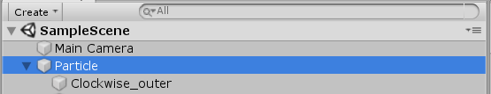
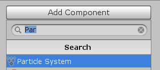
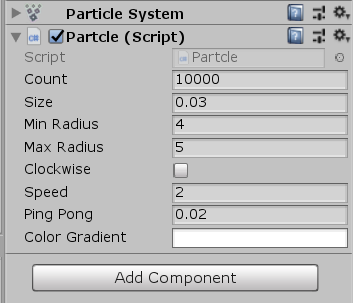
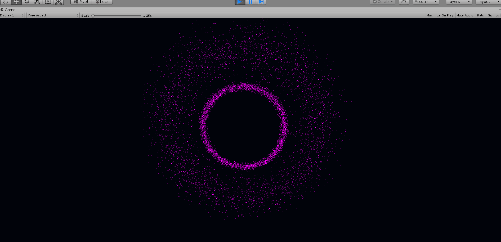

# Homework 7

### 编程实践——粒子光环

##### 实验过程

首先创建空对象，命名为`Particle`，然后创建其子对象，命名为`Clockwise_outer`



在`Clockwise_outer`中点击`Add Component`，输入`Particle System`，添加粒子系统



接下来是代码部分

我们需要一个`CirclePosition`类，规定了粒子的半径，角度和时间。

```c#
public class CirclePosition
{
    public float radius = 0f, angle = 0f, time = 0f;
    public CirclePosition(float radius, float angle, float time)
    {
        this.radius = radius;   // 半径
        this.angle = angle;     // 角度
        this.time = time;       // 时间
    }
}
```

定义粒子系统的变量。

```c#
private ParticleSystem particleSys;  // 粒子系统
private ParticleSystem.Particle[] particleArr;  // 粒子数组
private CirclePosition[] circle; // 极坐标数组
public int count = 10000;       // 粒子数量
public float size = 0.03f;      // 粒子大小
public float minRadius = 5.0f;  // 最小半径
public float maxRadius = 12.0f; // 最大半径
public bool clockwise = true;   // 顺时针|逆时针
public float speed = 2f;        // 速度
public float pingPong = 0.02f;  // 游离范围
public Gradient colorGradient;
```

在`Start`函数中对粒子系统进行初始化。

```c#
void Start ()
    {   // 初始化粒子数组
        particleArr = new ParticleSystem.Particle[count];
        circle = new CirclePosition[count];
 
        // 初始化粒子系统
        particleSys = this.GetComponent<ParticleSystem>();
        particleSys.startSpeed = 0;            // 粒子位置由程序控制
        particleSys.startSize = size;          // 设置粒子大小
        particleSys.loop = false;
        particleSys.maxParticles = count;      // 设置最大粒子量
        particleSys.Emit(count);               // 发射粒子
        particleSys.GetParticles(particleArr);
 
        // 初始化梯度颜色控制器
        GradientAlphaKey[] alphaKeys = new GradientAlphaKey[5];
        alphaKeys[0].time = 0.0f; alphaKeys[0].alpha = 1.0f;
        alphaKeys[1].time = 0.4f; alphaKeys[1].alpha = 0.4f;
        alphaKeys[2].time = 0.6f; alphaKeys[2].alpha = 1.0f;
        alphaKeys[3].time = 0.9f; alphaKeys[3].alpha = 0.4f;
        alphaKeys[4].time = 1.0f; alphaKeys[4].alpha = 0.9f;
        GradientColorKey[] colorKeys = new GradientColorKey[2];
        colorKeys[0].time = 0.0f; colorKeys[0].color = Color.white;
        colorKeys[1].time = 1.0f; colorKeys[1].color = Color.white;
        colorGradient.SetKeys(colorKeys, alphaKeys);
 
        // 初始化各粒子位置

        for (int i = 0; i < count; ++i)
        {   // 随机每个粒子距离中心的半径，同时希望粒子集中在平均半径附近
            float midRadius = (maxRadius + minRadius) / 2;
            float minRate = Random.Range(1.0f, midRadius / minRadius);
            float maxRate = Random.Range(midRadius / maxRadius, 1.0f);
            float radius = Random.Range(minRadius * minRate, maxRadius * maxRate);
 
            // 随机每个粒子的角度
            float angle = Random.Range(0.0f, 360.0f);
            float theta = angle / 180 * Mathf.PI;
 
            // 随机每个粒子的游离起始时间
            float time = Random.Range(0.0f, 360.0f);
 
            circle[i] = new CirclePosition(radius, angle, time);
 
            particleArr[i].position = new Vector3(circle[i].radius * Mathf.Cos(theta), 0f, circle[i].radius * Mathf.Sin(theta));
        }
 
        particleSys.SetParticles(particleArr, particleArr.Length);   
    }
```

在`Update`函数中为了使得粒子看起来更加分散和动态性，对粒子进行了分层，一共分为10层，每一层的角度会有所不同。

```c#
private int tier = 10;  // 速度差分层数
void Update ()
{
    for (int i = 0; i < count; i++)
    {
        if (clockwise)  // 顺时针旋转
            circle[i].angle -= (i % tier + 1) * (speed / circle[i].radius / tier);
        else            // 逆时针旋转
            circle[i].angle += (i % tier + 1) * (speed / circle[i].radius / tier);

        // 保证angle在0~360度
        circle[i].angle = (360.0f + circle[i].angle) % 360.0f;
        circle[i].time += Time.deltaTime;
        circle[i].radius += Mathf.PingPong(circle[i].time / minRadius / maxRadius, pingPong) - pingPong / 2.0f;
        particleArr[i].color = colorGradient.Evaluate(circle[i].angle / 360.0f);

        float theta = circle[i].angle / 180 * Mathf.PI;

        particleArr[i].position = new Vector3(circle[i].radius * Mathf.Cos(theta), 0f, circle[i].radius * Mathf.Sin(theta));
    }

    particleSys.SetParticles(particleArr, particleArr.Length);
}
```

最后我们创建另一个子对象，命名为`Anticlockwise_inner`。将代码拖进这两个子对象中。`Anticlockwise_inner`将代码选项中的`clockwise`选项去掉。



最后调整两个环半径大小就可以实现粒子光环了。

效果图：



