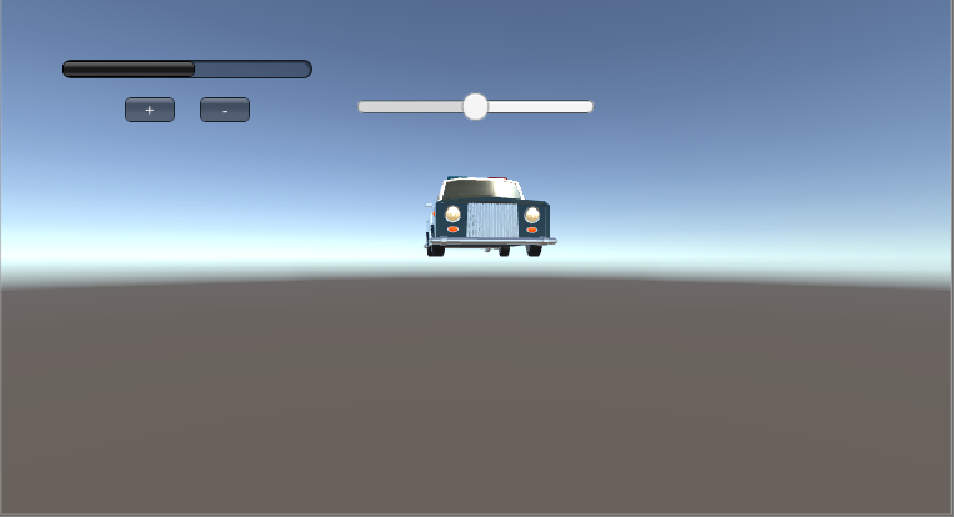
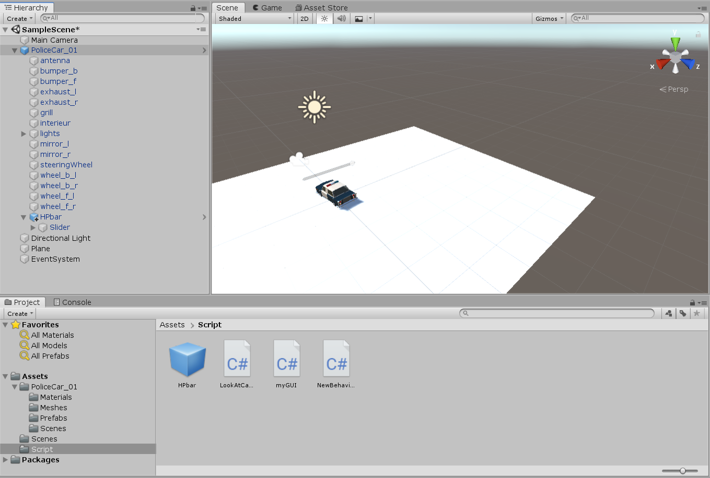
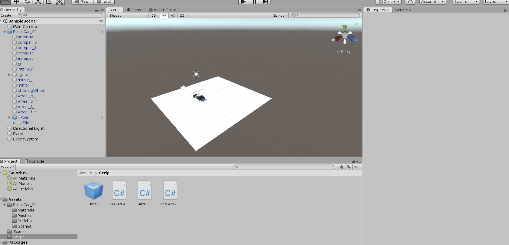

# 血条的预制设计

## 需求

- 分别使用 IMGUI 和 UGUI 实现
- 使用 UGUI，血条是游戏对象的一个子元素，任何时候需要面对主摄像机
- 分析两种实现的优缺点
- 给出预制的使用方法

## 实现过程

我同时使用了IMGUI和GUI实现了血条。

```c#
public class myGUI : MonoBehaviour
{
    public float health = .5f;
    private float resultHealth;
    public Slider healthSlider;

    private Rect HealthBar;
    private Rect HealthUp;
    private Rect HealthDown;

    void Start()
    {
        HealthBar = new Rect(50, 50, 200, 20);
        HealthUp = new Rect(105, 80, 40, 20);
        HealthDown = new Rect(155, 80, 40, 20);
        resultHealth = health;
    }

    void OnGUI()
    {
        if (GUI.Button(HealthUp, "+"))
        {
            resultHealth = resultHealth + 0.1f > 1.0f ? 1.0f : resultHealth + 0.1f;
        }
        if (GUI.Button(HealthDown, "-"))
        {
            resultHealth = resultHealth - 0.1f < 0.0f ? 0.0f : resultHealth - 0.1f;
        }
        
        healthSlider.value = health = Mathf.Lerp(health, resultHealth, 0.05f);
        
        GUI.HorizontalScrollbar(HealthBar, 0.0f, health, 0.0f, 1.0f);
    }
}
```

效果图如下：



其中，左上的血条和加减按键是用IMGUI实现的，而车辆上方的血条是用UGUI实现的。

### 两种实现的优缺点：

- ##### IMGUI

  - 优点：
    - IMGUI 接口简单易用
  - 缺点：
    - IMGUI 代码编码不直观，修改调试复杂，很多参数比如位置需要手动确认
    - IMGUI 实现的血条是直接渲染在屏幕上的，不能移动

- ##### UGUI

  - 优点：
    - 拥有设计工具，所见即所得
    - 允许设计师参与游戏 UI 开发，减少了程序员的工作量，加快了游戏开发速度
    - 面向对象编程，血条可以跟随车辆移动
  - 缺点：
    - UGUI 渲染效率要低于 IMGUI


### 给出预制的使用方法：

拖入 HPBar 预置到 Car 的子 GameObject即可。



### 演示图



