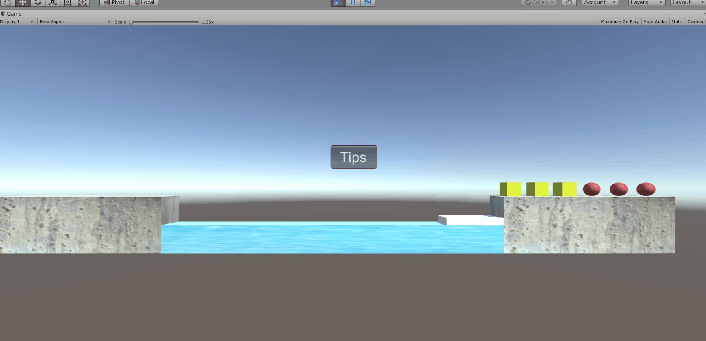

# P&D 过河游戏智能帮助实现

## 需求

- 实现状态图的自动生成
- 讲解图数据在程序中的表示方法
- 利用算法实现下一步的计算

## 实现过程

### 实现状态图的自动生成&讲解图数据在程序中的表示方法

牧师与魔鬼状态可以用一个三元组（O,P,D)来表示，分别表示当前船的位置（0表示在出发地，1表示在目的地），出发地牧师数量和出发地魔鬼数量，状态数一共是$2 * 4*4=32$

我先用c++写了一个小程序构造出状态转移矩阵

首先求出每个状态下转移的邻接矩阵，转移表存储在数组$a[32][32]$中，如果状态i可以一步到达状态j，则$a[i][j]=1$，否则$a[i][j]=0$

```c++
int get(int o,int i,int j){ //将三元组转化成状态编号
    return o*16+i*4+j;
}
bool jud(int o,int i,int j){ //判断当前状态是否合法
    if (i<0||i>3||j<0||j>3) return 0;
    if ((i<j)&&(i!=0)) return 0;
    if ((3-i<3-j)&&(3-i!=0)) return 0;
    return 1;
}
#define rep(i,l,r) for (int i=l;i<=r;i++)
rep(o,0,1){
    rep(i,0,3){
        rep(j,0,3){
            int st=get(o,i,j);
            if (!jud(o,i,j)) continue;
            if (o==0){  //from 出发地的牧师和魔鬼只可能减少
                rep(dx,-2,0) rep(dy,-2,0) if (1<=abs(dx+dy)&&abs(dx+dy)<=2){
                    if (!jud(o^1,i+dx,j+dy)) continue;
                    a[get(o,i,j)][get(o^1,i+dx,j+dy)]=1;
                }
            }
            else { //to 出发地的牧师和魔鬼只可能增加
                rep(dx,0,2) rep(dy,0,2) if (1<=dx+dy&&dx+dy<=2){
                    if (!jud(o^1,i+dx,j+dy)) continue;
                    a[get(o,i,j)][get(o^1,i+dx,j+dy)]=1;
                }
            }
        }
    }
}
```

然后用最短路算法spfa求出所有状态到终点（1，0，0）的最短路距离

```c++
rep(o,0,1) rep(i,0,3) rep(j,0,3) dis[get(o,i,j)]=inf; 
dis[get(1,0,0)]=0;
queue<int> q; q.push(get(1,0,0)); vis[get(1,0,0)]=1; 
while (!q.empty()){
    int u=q.front(); q.pop(); vis[u]=0;
    int uo=u/16,ux=(u%16)/4,uy=u%4;
    rep(i,-2,2) rep(j,-2,2) {
        int vo=uo^1,vx=ux+i,vy=uy+j;
        int v=get(vo,ux+i,uy+j);
        if (jud(vo,vx,vy)&&a[v][u]&&dis[v]>dis[u]+1){  
            //如果状态v能到达状态u且能够更新状态v的距离
            dis[v]=dis[u]+1;
            if (!vis[v]) vis[v]=1,q.push(v);
        }
    }
}
```

我们只需要保留在最短路图上的边并输出

```c++
rep(o,0,1) rep(i,0,3) rep(j,0,3){
    rep(x,0,3) rep(y,0,3) {
        if (dis[get(o,x,y)]==dis[get(o^1,i,j)]+1&&a[get(o,x,y)][get(o^1,i,j)]) a[get(o,x,y)][get(o^1,i,j)]=1;
        else a[get(o,x,y)][get(o^1,i,j)]=0;
    }
}
rep(o,0,1) rep(i,0,3) rep(j,0,3){
    printf("{");
    rep(no,0,1) rep(x,0,3) rep(y,0,3) {
        printf("%d",a[get(o,i,j)][get(no,x,y)]);
        if (x==3&&y==3&&no==1) printf("},\n");
        else printf(",");
    }
}
```

#### 状态转移矩阵

```c++
{{0,0,0,0,0,0,0,0,0,0,0,0,0,0,0,0,0,0,0,0,0,0,0,0,0,0,0,0,0,0,0,0},
            {0,0,0,0,0,0,0,0,0,0,0,0,0,0,0,0,1,0,0,0,0,0,0,0,0,0,0,0,0,0,0,0},
            {0,0,0,0,0,0,0,0,0,0,0,0,0,0,0,0,1,0,0,0,0,0,0,0,0,0,0,0,0,0,0,0},
            {0,0,0,0,0,0,0,0,0,0,0,0,0,0,0,0,0,1,0,0,0,0,0,0,0,0,0,0,0,0,0,0},
            {0,0,0,0,0,0,0,0,0,0,0,0,0,0,0,0,0,0,0,0,0,0,0,0,0,0,0,0,0,0,0,0},
            {0,0,0,0,0,0,0,0,0,0,0,0,0,0,0,0,1,0,0,0,0,0,0,0,0,0,0,0,0,0,0,0},
            {0,0,0,0,0,0,0,0,0,0,0,0,0,0,0,0,0,0,0,0,0,0,0,0,0,0,0,0,0,0,0,0},
            {0,0,0,0,0,0,0,0,0,0,0,0,0,0,0,0,0,0,0,0,0,0,0,0,0,0,0,0,0,0,0,0},
            {0,0,0,0,0,0,0,0,0,0,0,0,0,0,0,0,0,0,0,0,0,0,0,0,0,0,0,0,0,0,0,0},
            {0,0,0,0,0,0,0,0,0,0,0,0,0,0,0,0,0,0,0,0,0,0,0,0,0,0,0,0,0,0,0,0},
            {0,0,0,0,0,0,0,0,0,0,0,0,0,0,0,0,0,0,1,0,0,0,0,0,0,0,0,0,0,0,0,0},
            {0,0,0,0,0,0,0,0,0,0,0,0,0,0,0,0,0,0,0,0,0,0,0,0,0,0,0,0,0,0,0,0},
            {0,0,0,0,0,0,0,0,0,0,0,0,0,0,0,0,0,0,0,0,0,0,0,0,0,0,0,0,0,0,0,0},
            {0,0,0,0,0,0,0,0,0,0,0,0,0,0,0,0,0,0,0,0,0,1,0,0,0,0,0,0,0,0,0,0},
            {0,0,0,0,0,0,0,0,0,0,0,0,0,0,0,0,0,0,0,0,0,0,0,0,0,0,0,0,1,0,0,0},
            {0,0,0,0,0,0,0,0,0,0,0,0,0,0,0,0,0,0,0,0,0,0,0,0,0,0,1,0,0,1,0,0},
            {0,0,0,0,0,0,0,0,0,0,0,0,0,0,0,0,0,0,0,0,0,0,0,0,0,0,0,0,0,0,0,0},
            {0,0,1,0,0,1,0,0,0,0,0,0,0,0,0,0,0,0,0,0,0,0,0,0,0,0,0,0,0,0,0,0},
            {0,0,0,1,0,0,0,0,0,0,0,0,0,0,0,0,0,0,0,0,0,0,0,0,0,0,0,0,0,0,0,0},
            {0,0,0,0,0,0,0,0,0,0,0,0,0,0,0,0,0,0,0,0,0,0,0,0,0,0,0,0,0,0,0,0},
            {0,0,0,0,0,0,0,0,0,0,0,0,0,0,0,0,0,0,0,0,0,0,0,0,0,0,0,0,0,0,0,0},
            {0,0,0,0,0,0,0,0,0,0,1,0,0,0,0,0,0,0,0,0,0,0,0,0,0,0,0,0,0,0,0,0},
            {0,0,0,0,0,0,0,0,0,0,0,0,0,0,0,0,0,0,0,0,0,0,0,0,0,0,0,0,0,0,0,0},
            {0,0,0,0,0,0,0,0,0,0,0,0,0,0,0,0,0,0,0,0,0,0,0,0,0,0,0,0,0,0,0,0},
            {0,0,0,0,0,0,0,0,0,0,0,0,0,0,0,0,0,0,0,0,0,0,0,0,0,0,0,0,0,0,0,0},
            {0,0,0,0,0,0,0,0,0,0,0,0,0,0,0,0,0,0,0,0,0,0,0,0,0,0,0,0,0,0,0,0},
            {0,0,0,0,0,0,0,0,0,0,0,0,0,0,1,0,0,0,0,0,0,0,0,0,0,0,0,0,0,0,0,0},
            {0,0,0,0,0,0,0,0,0,0,0,0,0,0,0,0,0,0,0,0,0,0,0,0,0,0,0,0,0,0,0,0},
            {0,0,0,0,0,0,0,0,0,0,0,0,0,1,0,0,0,0,0,0,0,0,0,0,0,0,0,0,0,0,0,0},
            {0,0,0,0,0,0,0,0,0,0,0,0,0,0,1,0,0,0,0,0,0,0,0,0,0,0,0,0,0,0,0,0},
            {0,0,0,0,0,0,0,0,0,0,0,0,0,0,0,1,0,0,0,0,0,0,0,0,0,0,0,0,0,0,0,0},
            {0,0,0,0,0,0,0,0,0,0,0,0,0,0,0,0,0,0,0,0,0,0,0,0,0,0,0,0,0,0,0,0}}
```

在游戏中通过这张状态表就可以得知下一步应该到达哪一个状态了。

### 利用算法实现下一步的计算

在之前作业5中（<https://blog.csdn.net/ctlchild/article/details/101454426>）

加入类` AI`，其中实现了函数`tip`，读取起点终点的牧师魔鬼数量，船的状态，计算出当前的状态，并根据转移表选择下一步的选择。

```c#
public int tip(CoastCon fromCoast,CoastCon toCoast,BoatCon boat) {	
    int fromP = 0, fromD = 0, toP = 0, toD = 0, boatst = 0;
    int[] fromCount = fromCoast.getCharacterNum();
    fromP += fromCount[0];
    fromD += fromCount[1];

    int[] toCount = toCoast.getCharacterNum ();
    toP += toCount[0];
    toD += toCount[1];

    int[] boatCount = boat.getCharacterNum ();
    if (boat.getStatus ()==-1) boatst=1;
    else boatst=0;
    if (boat.getStatus () == -1) {
        toP += boatCount[0]; toD += boatCount[1];	// boat at toCoast
    }
    else {
        fromP += boatCount[0]; fromD += boatCount[1];	// boat at fromCoast	
    }
    Debug.Log(fromP.ToString()+' '+fromD.ToString()+' '+get(boatst,fromP,fromD).ToString());
    for (int o=0;o<=1;o++)
        for (int i=0;i<=3;i++) 
            for (int j=0;j<=3;j++) 
                if (trans[get(boatst,fromP,fromD),get(o,i,j)]==1) return get(boatst,i,j);

    return -1;
}
```


## 运行效果



